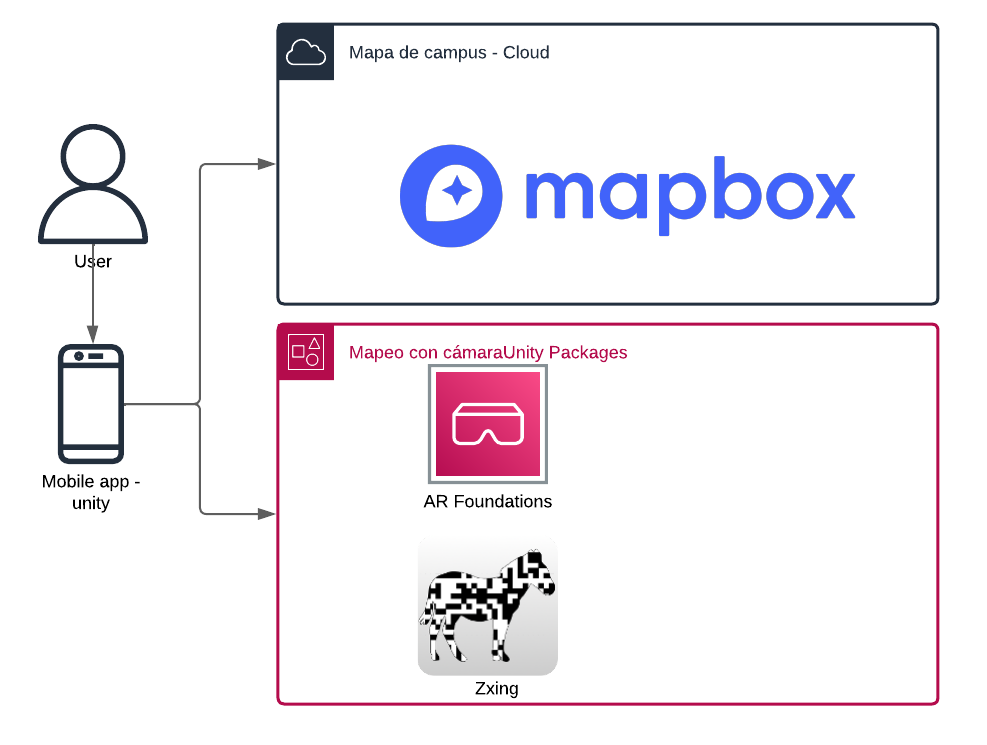
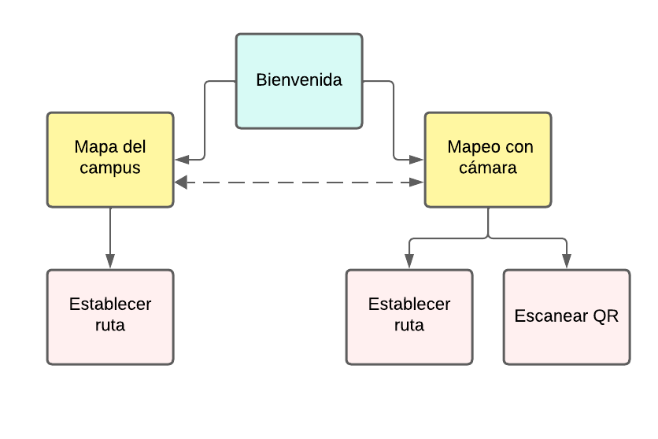

# Routing | PoT sobre realidad aumentada proyectada

## Objetivo:
 Aplicacion de realidad aumentada con geolocalizacion, la cual ayude al usuario a trasladarse de un edificio del campus a otro, que lo pueda hacer de la forma tradicional en que las aplicaciones te dan instrucciones (una ruta trazada en el mapa), y que aparte se pueda ayudar de la camara de  su dispositivo, para que la aplicacion detecte un trigger como punto de inicio y de ahi me vaya pintando en la imagen las flechas de hacia donde moverme 

## Arquitectura (diagrama)

##  archivos (C#)
- Carta.cs: Define una clase Carta que representa una carta con un título, dos descripciones y una imagen. Incluye un constructor para inicializar estos valores.
- GameManager.cs: Este script maneja la lógica de cambio de escenas en un juego de Unity. Contiene métodos para cargar diferentes escenas, como ChangeSceneCero para cargar la escena "Campus" y ChangeSceneUno para cargar la escena "SampleScene".
- Panel.cs: Este script controla la visibilidad de dos objetos de juego (map y Panell) en Unity. Contiene métodos para activar (onClickButon) y desactivar (DesClickButon) estos objetos cuando se hace clic en un botón.
- QrCodeRecenter.cs: Este script maneja la lógica para recentrar la sesión de AR en Unity utilizando códigos QR. Utiliza ARCameraManager) para recibir frames de la cámara y decodificar códigos QR usando ZXing).
- RaycastFloor.cs: Este script maneja la detección de clics en el suelo y la actualización de una tarjeta de información en la interfaz de usuario. Utiliza un GraphicRaycaster) para detectar clics en la UI y actualiza los textos e imágenes de la tarjeta con información relevante.
- SetNavigationTarget.cs: Este script maneja la navegación en Unity utilizando NavMesh. Permite seleccionar un objetivo de navegación desde un TMP_Dropdown) y dibuja la ruta calculada en la escena usando un LineRenderer).
- SetNavigationTarget2.cs: Este script maneja la navegación en Unity utilizando NavMesh. Define objetivos de navegación, calcula rutas con NavMeshPath) y dibuja la ruta usando un LineRenderer). También maneja la visibilidad de una tarjeta de información en la interfaz de usuario.
- Target.cs: Este script define una clase serializable Target) que contiene un nombre y un objeto de juego que representa la posición del objetivo.

### Assets

- Card: Elemento de UI encargado de desplegar información de los edificios del campuos
- Enviroment: Croquis de un edificio, compuesto de piso y paredes
- LocationBasedGame: Mapa de mapbox con un indicador

## Como funciona (mapa de navegación)

## Historia de usuario

1. 
- El usuario inicia la aplicación
- El mapa es desplegado y su posicion dentro de el 
- El usuario intereactua con el mapa
- El usuario elige un destino y se muestra la ruta 
2. 
- El usuario inicia la aplicación
- La camara y un minimapa es desplegado y su posicion dentro de el 
- El usuario elige un destino y se muestra la ruta en la cámara